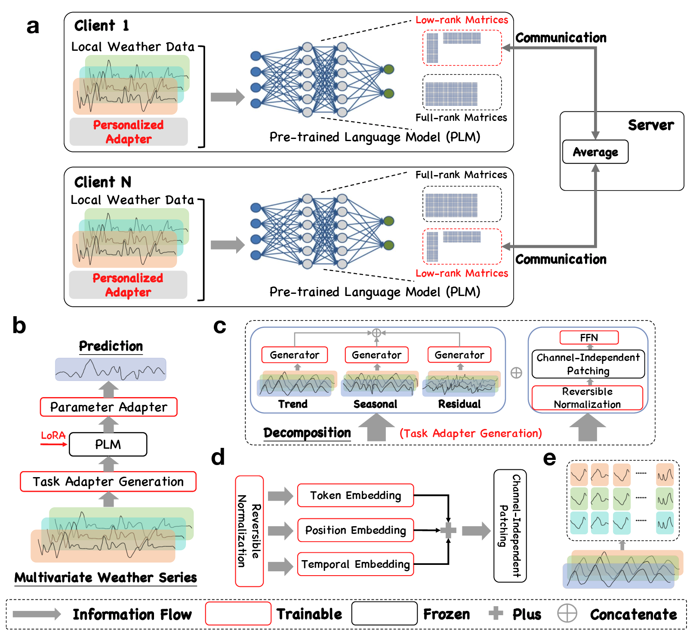

# Personalized Adapter for Large Meteorology Model on Devices: Towards Weather Foundation Models

[](https://openreview.net/forum?id=llTroju97T)
[](https://opensource.org/licenses/MIT)

This is the official implementation for "Personalized Adapter for Large Meteorology Model on Devices: Towards Weather Foundation Models" (NeurIPS 2024).

## News
- [2025.01] 🚀 Datasets are under external review and licensing. Public release expected early Feb. 
- [2024.12] 🔥 Official code implementation posted. ~~Full utilization guide coming soon.~~ Tutorials have been released.
- [2024.09] 📢 Paper accepted at NeurIPS 2024.
  
## Project Status
- [x] Release code
- [x] Release detailed training tutorials
- [ ] License detailed dataset
- [x] corresponding tutorials
- [x] Release papers

**Remark.** Before we relsease the full datasets, you can try our framework on your own datasets according to the dataset format of [Time-Series-Library](https://github.com/thuml/Time-Series-Library).

## Overview
LM-Weather demonstrates that pre-trained language models (PLMs) can serve as powerful foundation models for on-device meteorological modeling. Our approach enables:

- Customized models for heterogeneous meteorological data
- Efficient knowledge fusion via low-rank transmission  
- Privacy-preserving communication between clients and server
- Strong performance on forecasting and imputation tasks




## Abstract
This paper demonstrates that pre-trained language models (PLMs) are strong foundation models for on-device meteorological variable modeling. We present LM-Weather, a generic approach to taming PLMs, that have learned massive sequential knowledge from the universe of natural language databases, to acquire an immediate capability to obtain highly customized models for heterogeneous meteorological data on devices while keeping high efficiency. Concretely, we introduce a lightweight personalized adapter into PLMs and endows it with weather pattern awareness. During communication between clients and the server, low-rank-based transmission is performed to effectively fuse the global knowledge among devices while maintaining high communication efficiency and ensuring privacy. Experiments on real-wold dataset show that LM-Weather outperforms the state-of-the-art results by a large margin across various tasks (e.g., forecasting and imputation at different scales). We provide extensive and in-depth analyses experiments, which verify that LM-Weather can (1) indeed leverage sequential knowledge from natural language to accurately handle meteorological sequence, (2) allows each devices obtain highly customized models under significant heterogeneity, and (3) generalize under data-limited and out-of-distribution (OOD) scenarios.

## Quick Start
### Clone this repository
```git clone https://github.com/username/LM-Weather.git```

### Install dependencies
```pip install -r requirements.txt```

### LLM(s) and Time Series Benchmark Preparation
- We used GPT2 as the foundation model during experiments, supported by OpenAI and Huggingface. You can [download weights](https://huggingface.co/openai-community/gpt2/tree/main) (at your own risk) here.
- We employed PEFT (Parameter-Efficient Fine-Tuning) techniques to facilitate the adaptation of the foundational model. PEFT is supported by [Huggingface PEFT](https://github.com/huggingface/peft), which you can clone or use directly from our repository.
- We utilized various time series models as the baseline, supported by the [Time-Series-Library](https://github.com/thuml/Time-Series-Library),. You can clone it or use it directly from our repository.
- For additional experiments with different LLM backbones, you can download models [Open-LLAMA](https://huggingface.co/openlm-research/open_llama_3b_v2) and [Bert](https://huggingface.co/google-bert/bert-base-uncased).

### Training Script Parameters Explanation

Below is a detailed explanation of the training script parameters (example):

| Parameter | Value | Description |
|-----------|-------|-------------|
| seq_len | 192 | Input sequence length |
| pred_len | [96,192,336,720] | Prediction sequence length for different forecasting ranges |
| label_len | 48 | Length of labels used in training |
| lbs (batch_size) | 256 | Training batch size |
| nc (num_clients) | 15 | Number of clients in federated setting |
| jr (join_ratio) | 0.1 | Ratio of clients participating in each round |
| ls (local_steps) | 5 | Number of local training steps |
| lr | 0.005 | Learning rate |
| eg (eval_gap) | 5 | Gap between evaluations |
| gr (global_round) | 50 | Number of global communication rounds |

**Model Configuration:**
- `base_model`: GPT2 - Using GPT2 as foundation model (Bert or LLAMA)
- `freeze_part`: 2 - Number of frozen layers 
- `gpt_layers`: 1 - Number of GPT layers to use
- `lradj`: type1 - Learning rate adjustment type

**PEFT Settings:**
- `is_peft`: 1 - Enable PEFT
- `peft`: lora - Using LoRA as PEFT method
- `rank`: 32 - Rank for LoRA adaptation

**Data Configuration:**
- `features`: MS - Multivariate input, Single output
- `freq`: h - Hourly frequency 
- `target`: rh - Target variable (relative humidity, you can custimise it in you mind)
- `dataset`: Weather-Tiny - Dataset name (You can customise it in you mind)

Example usage:
```bash
bash scripts/long_term_forecast.sh
```

## Please cite our publication if you found our research to be helpful and insightful.

```bibtex
@inproceedings{
chen2024personalized,
title={Personalized Adapter for Large Meteorology Model on Devices: Towards Weather Foundation Models},
author={Shengchao Chen and Guodong Long and Jing Jiang and Chengqi Zhang},
booktitle={The Thirty-eighth Annual Conference on Neural Information Processing Systems},
year={2024},
url={https://openreview.net/forum?id=llTroju97T}
}
```

## License
This project is licensed under the MIT License.

## Acknolwedgement
> [!note]
> We are reshaping our code. There may be some changes to the code. 
> We are grateful for the many open source frameworks that have given us support, including [Time-Series-Library](https://github.com/thuml/Time-Series-Library), [Huggingface PEFT](https://github.com/huggingface/peft), and [PFLlib](https://github.com/TsingZ0/PFLlib).
